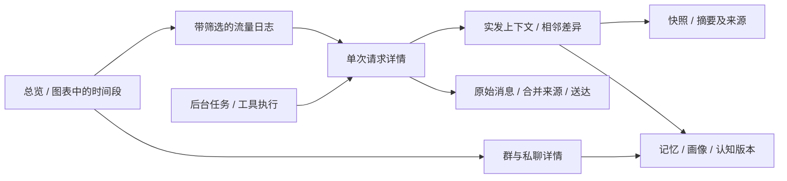

# TangtangHarness 本地可视化需求与实施方案

本文件保留需求盘点、指标定义和建设顺序，依据 2026-10-04 的 Harness 源码与运行数据核对。A–E 批次的只读统计接口、七个主看板、图表与表格、匿名导出及必要观测采集已实现，实际页面说明见[控制台](控制台.md)。CPU/内存、容量与队列的持久历史采样仍为可选后续项，当前只显示实测现态；未报告的供应商字段不补造。运行数据持续增长，本文不固定实例数量、模型配置、群身份或聊天原文。

## 1. 建设目标与现状

在现有本机控制台内扩展完整的数据浏览与分析能力。入口继续使用 `http://127.0.0.1:8090/`，新内容留在 TangtangHarness 内。

网页应让操作者能回答：

1. 这条 QQ 消息是否调用模型，调用了几次，为什么调用？
2. 每次实际请求消耗多少输入、输出和缓存读取 token，耗时多少？
3. 哪些群、模型和后台任务贡献了输入量、费用和缓存变化？
4. 模型实际看到了哪些历史、图片、记忆、画像和摘要，哪些内容被裁剪？
5. 上下文何时接近预算、何时压缩、发布了哪个版本，之后缓存如何变化？
6. 个人资料有哪些来源和版本，本轮采用了哪些？
7. 本地工具、后台整理和 QQ 送达是否完成，等待发生在哪一步？

可视化提供比较和解释依据；真实缓存改善仍需同条件实验。查询和绘图在本地完成，查看数据和离线预览不产生模型调用。

建设前的 React 控制台已有会话、实际上下文、缓存与用量、模型与设置、请求预览、工具与后台、实验七页，能展示单请求 usage、上下文分层条、预算水位、payload、相邻请求差异和按模型汇总。本方案补充的时间序列、流量表、群与用户钻取，以及记忆、画像和快照入口已完成；下方盘点与工作量保留为建设基线，当前验证结果见[实施验收记录](实施验收记录.md#本地可视化交付)。

## 2. 数据对象与来源

不能把 QQ 消息、模型请求、已送达交流轮次、个人资料当作同一种对象。

| 对象 | 实际来源 | 展示边界 |
| --- | --- | --- |
| 收到的消息 | `harness.db/events` | 本地工具可能零调用；短消息可能合并；收到消息不代表机器人已经回复 |
| 模型请求尝试 | `requests` 的 payload、usage、telemetry、outcome | 每次重试和故障切换单独计数；观察、预览记录与实际调用分开 |
| 已完成交流 | `turns`、`deliveries` | 模型生成与平台确认送达分开；历史导入轮次没有新模型 usage |
| 群与私聊上下文 | 请求 telemetry、`sessions`、`snapshots` | 请求记录说明当时实发内容；当前资料和离线预览说明现在的构建状态 |
| 新记忆、认知和成长 | 对应 records、versions、`impression_events` | 显示作用范围、状态、证据和版本；保存不等于本轮采用 |
| 新个人画像 | settings 中的 profile、profile_version | 自动画像当前关闭且暂无新版本，应显示未生成和停用状态 |
| 群话题摘要 | settings 中的 `group_state:*`、summary 后台任务 | 当前摘要覆盖保存；与有独立版本的上下文压缩快照分开 |
| 已导入旧资料 | `legacy_rows` 和来源映射 | 区分导入归档、当前可用、本轮实际采用；按原始资料时间查看 |
| 群与成员发言统计 | `business.db` 中 daily_counts、member_totals、group_members | 发言统计包括符合统计规则的消息，不等于模型输入量 |
| 发言档案与本地画像 | `business-history.db`、`tangtang_group_messages`、本地统计服务 | 统计特征与 AI 生成正文分开；保留查询范围 |
| 工具和业务记录 | `tools`、`harness_tool_usage`、业务数据库 | 执行耗时与网络、渲染、送达耗时分别理解 |
| 续聊与主动策略 | `continuation.db`、proactive settings、请求 purpose | 额度、尝试、沉默与实际模型调用分别展示 |
| 运行与连接 | `/api/status`、transport_incidents、独立语音状态 | 当前在线状态与历史事故分开；主机资源曲线需另有采样 |

管理网页可以比较多个群，但群聊天上下文仍按当前群隔离。个人页面按用户及会话范围浏览；私聊可用的本人发言不能变成其他用户或群摘要输入。

实现依据：[API 与指标](../tangtang_harness/app.py)、[usage 归一与价格估算](../tangtang_harness/models.py)、[上下文构建](../tangtang_harness/context.py)、[持久存储](../tangtang_harness/store.py)、[个人档案](../tangtang_harness/business/tangtang_db.py)、[现有前端](../frontend/src/App.tsx)。

## 3. 核心可视化清单

“直接”表示已有数据和查询入口，仍需前端实现；“聚合”表示数据已经保存，需补全量筛选或只读统计 API；“采集”表示仅能在补字段后记录未来数据。成本为相对实现工作量，不是费用估算。

| 主题 | 必须展示的内容 | 合适的图表或交互 | 可用程度 / 成本 | 优先级 |
| --- | --- | --- | --- | --- |
| 总览 | 请求量、输入/输出、缓存占比、覆盖率、已知估算费用、响应 P50/P95、后台占比 | KPI 卡、趋势小图、用途条形图；点击进入筛选日志 | 聚合 / 中 | 首期 |
| 流量日志 | 时间、群/私聊、触发用户、模型/渠道、用途、状态、token、费用、延迟 | 排序分页表、详情抽屉、同消息多次尝试展开 | 数据已有，需轻量列表 / 中 | 首期 |
| 输入输出趋势 | 总输入、缓存读取、非缓存输入、输出及可报告推理 token | 堆叠面积图、小时/日柱图 | 聚合 / 低 | 首期 |
| 缓存变化 | token 加权占比、请求命中比例、覆盖率、样本量 | 分开对齐的折线图、命中/未命中/未知环形图 | 聚合 / 中 | 首期 |
| 缓存分布 | 完全未命中、低/中/高占比请求分布 | 分桶柱图、模型与用途比较表 | 聚合 / 低 | 首期 |
| 费用分布 | 已知估算金额、未知样本、前台/后台/实验用途 | 趋势图、用途环形图、模型横条 | 数据已有，币种和价格版本需补 / 中 | 首期 |
| 请求延迟 | 模型耗时、P50/P95、超时和失败、输入量关系 | 折线、直方图、散点图 | 总延迟已有；分阶段需采集 / 中 | 首期 |
| 实发上下文 | 固定、快照、历史、动态层、图片、来源、采用与排除项 | 分层堆叠条、来源表、正文展开、图片按需加载 | 直接，排除原因需补细节 / 中 | 首期 |
| 相邻请求差异 | 固定前缀 hash、历史增减、动态层、参数与快照变化 | 双栏 diff、变更列表、公共前缀字节指标 | 直接 / 中 | 首期 |
| 群上下文增长 | 每次请求估算输入/实际输入、预算、裁剪数量、压缩发布 | 对齐时间图、水位线、压缩标记、层组成图 | 聚合 / 中 | 首期 |
| 压缩快照 | 版本、发布时间、来源轮次范围、事实/承诺/未决事项 | 版本时间线、前后差异、体积趋势 | 快照 API 已有 / 低 | 首期 |
| 群话题摘要 | 最新主题、摘要覆盖游标、未处理消息、来源范围 | 主题卡、来源表、任务时间线 | 最新值直接；历史重建/后续版本需补 / 中 | 首期 |
| 个人长期记忆 | 类别、当前/遗忘状态、版本、证据、采用记录 | 分类表、版本时间线、每日变更柱图 | 当前 API 已有；版本列表需补 / 低至中 | 首期 |
| 个人画像与印象 | 当前版本、生成/复核状态、证据、更新时间 | 内容卡、版本 diff、印象变化表 | 数据/API 已有；新画像暂无版本 / 低 | 首期 |
| 认知与成长 | 约定、观点、待办、状态、证据、公共成长版本 | 状态表、变更时间线、来源跳转 | 当前 API 已有；历史需补 / 低至中 | 首期 |
| 个人发言统计 | 日期、群分布、时段、重复表达、本地六维特征 | 日趋势、星期×小时热力图、条形图、已有维度雷达图 | 本地服务已有，需 SQL 聚合 API / 中 | 第二批 |
| 群发言统计 | 日周月总榜、活跃人数、各群趋势、成员贡献 | 趋势、排行表、Top N 横条、热力图 | 业务数据和排行 API 可复用 / 中 | 第二批 |
| 本地工具 | 调用量、结果、耗时、用户/群、关联模型调用数 | 执行表、调用趋势、耗时排名、零调用处理占比 | 聚合 / 中 | 首期 |
| QQ 回复与送达 | 模型完成、发送结果、平台回执、气泡数、部分失败 | 事件→请求→回复→回执时间线 | 直接；精确发送阶段耗时需补 / 中 | 首期 |
| 合并与续聊 | 合并来源、等待时间、续聊窗口、次数/日额度、沉默 | 消息链、额度条、尝试表、日趋势 | 合并已有 API；续聊需只读 API / 中 | 第二批 |
| 主动聊天 | 策略、尝试、沉默、送达、调用成本 | 策略比较表、每日次数、费用趋势 | 聚合 / 中 | 第二批 |
| 后台整理 | 类型、排队/运行/完成/失败/暂停、预算、关联请求、最老任务 | 队列状态表、年龄条、滚动预算条、用途 token 趋势 | 已有数据；全量统计与阶段时间需补 / 中 | 首期 |
| 模型比较 | 同用途的输入规模、缓存、耗时、费用和可报告样本量 | 比较表、分组横条、散点图 | 聚合 / 中 | 首期 |
| 缓存实验 | 冷请求、追加、前缀变化、压缩、显式预热的实际结果和费用 | 实验分组表、前后对比、请求跳转 | 已有执行入口；历史索引需补 / 中 | 第二批 |

画像雷达图只使用本地统计服务已经定义的维度、公式和样本数，不把生成的性格描述转换成虚构数值。当前六维为复读魂、好奇雷达、情绪电波、小作文、接话欲、情报站，实际是文本规则命中条数；一条消息可以命中多个维度，不能当人格分数或互斥饼图份额。维度未保存独立历史时序，日期比较需要从同范围档案重算。模型对比展示观察值，未控制输入和参数时不宣称因果关系或模型排名。

## 4. 业务与运行的补充视图

这些数据也有价值，但放在业务和运行页面内，不挤占缓存与上下文主界面。

| 领域 | 可展示内容 | 推荐形式 | 数据工作 |
| --- | --- | --- | --- |
| 群域和开关 | 群别名、集群关系、当前功能设置 | 群×功能矩阵、范围列表 | 读取新业务配置；展示配置与实际就绪状态 |
| 知识库 | 条目分类、审核状态、来源、更新时间、检索结果 | 分类表、待处理列表；次数只有已保存时才展示 | 现有知识库只读入口与聚合 |
| 小游戏 | 当前对局、战绩、处罚、到期状态、随机事件 | 对局表、战绩榜、玩法次数趋势 | 复用各玩法记录，不额外模型生成报表 |
| 缘分 | 关系、抽取/重抽/离婚、故事及互动记录 | 事件时间线、频次表；关系图作为可选视图 | 读取关系和事件，不把导入时刻当发生时刻 |
| 图库 | 抽取记录、近期使用、图片降权依据 | 缩略图表、抽取次数横条 | 已有记录；素材按需加载 |
| B站与直播 | 订阅、游标、更新、投递、登录状态、直播窗口 | 状态表、更新时间线、失败列表 | 现有状态读取；缺凭证准确显示未登录 |
| 日榜与报时 | 计划时点、投递完成、待重试、断连补发 | 日历/投递表、结果时间线 | 复用投递队列，不执行旧归档任务 |
| Core / 语音 | 开关、连接、最后错误、独立实例、语音队列与缓存 | 状态卡、任务表 | 只读现态；队列趋势需保存采样 |
| OneBot 连接 | 在线、断连、恢复、事故持续时间 | 状态卡、事故时间轴 | transport_incidents 已有，需查询 API |
| 文件与资源 | 新系统数据库/媒体/截图/音频占用、素材数量 | 分类表、大小横条 | 当前容量可本地读取；历史容量曲线需定时采样 |
| CPU / 内存 | Harness 当前进程资源与趋势 | 当前卡、折线图 | 当前控制台未保存采样，列为可选后续项 |
| 数据导入 | 来源类型、导入范围、归档/转为可用状态 | 导入表、来源覆盖说明 | 现有 imports 与来源映射；不是实时生产统计 |

## 5. 指标口径

所有卡片、表格和曲线保留时间范围、样本量、数据来源及更新时间。供应商 usage、本地估算、配置价格估算和未报告字段使用明确标签。

| 指标 | 定义与展示要求 |
| --- | --- |
| 单次缓存 token 占比 | 供应商缓存读取 token ÷ 归一化总输入 token；仅在字段和输入语义可判断时计算 |
| 加权缓存 token 占比 | 同一有效样本集合中的缓存读取总量 ÷ 输入总量；不能平均每次请求的百分比 |
| 请求命中比例 | 缓存读取 token 大于零的实际尝试数 ÷ 可判断是否命中的尝试数 |
| 缓存数据覆盖率 | 可判断缓存的实际尝试数 ÷ 对应范围实际尝试总数；token 占比需要的字段更完整，另显示有效样本数 |
| 已知输入/输出总量 | 求和仅有供应商真实值的记录，同时标注字段覆盖率；缺值不是零 |
| 非缓存输入 | 保留供应商字段语义；Anthropic 类分项中非读取输入可能含缓存写入，计费新输入另列，不重复相加 |
| 缓存写入 | 单独显示；没有字段时标注未报告，不并入读取命中 |
| 输出与推理 | 归一后的输出可能包含推理；仅在合同明确时拆可见输出，不能重复计数 |
| 已知估算费用 | 按请求记录的估算金额求和并显示价格覆盖率；缺币种先不展示货币符号，不同币种不直接相加 |
| 缓存节省估算 | 只有缓存读价、普通输入价、计费语义和币种明确时才显示；不是供应商账单 |
| 模型延迟 | 优先使用 adapter 的真实模型调用耗时；请求记录起止耗时另命名，避免混同 |
| 首次内容延迟 | 现有字段为流式首个文本内容块耗时；没有流式样本时显示未报告，不能从总耗时推算 |
| 排队年龄 | 当前时间减任务创建时间；合并会影响更新时间，不能用 updated-created 冒充等待或执行时间 |
| 零调用处理占比 | 以已识别并完成处理的用户请求为分母，标明样本范围；普通围观消息不计为零调用工具成功 |
| 送达比例 | 使用真实平台回执；完整送达、部分送达、失败分别列，不把模型成功等同于送达 |

补充规则：

- 一条消息可能对应零个、一个或多个请求；合并消息和后台批次又可能多对一。消息页按关联请求展开，不构造一对一缓存率。
- 纯本地工具显示“未调用模型”，其缓存指标显示“不适用”。
- 用户筛选标明“触发用户”或“资料来源用户”。不能把整段群上下文 token 当成这个人的专属消费；多来源后台任务不任意平分费用。
- 失败、超时、重试、后台整理、主动尝试和实验分别可筛选。失败未返回 usage 时，费用可能未知；预算预留也不是已消费 token。
- 每个时间桶重新求和计算占比；没有请求的时段显示无样本，未知不变成未命中。
- 按本机配置时区形成小时、日、周视图，查询时间采用明确边界。图上可查看桶范围和实际样本数。
- 本地公共前缀字节和 hash 可解释变化，无法确定供应商具体命中了哪一层；没有分层 usage 时不画“人格层实际命中率”。
- 请求层 token 是本地估算，含图片估算及协议开销差异，不要求与供应商总输入强行相等。
- 群上下文曲线是请求发生时的采样点；“最新请求水位”与“当前离线预览水位”分开，不插值为持续实测。
- 资料的首次导入时间不能代替记忆、画像或摘要的原始发生时间。历史缺少请求 usage 的范围只展示资料，不回填 token。
- 发言日报、累计表和排行快照是不同汇总视图，不能相加；business-history 中已整合的旧来源不能重复计数。Top100 排行人数不代表完整群人数，成员表也不是实时在线人数。
- 发言计数保留被过滤的入站消息，档案正文和模型输入遵循过滤范围；机器人发言以实际送达为准。图上分别说明统计与对话覆盖范围。
- 工具 usage 表未覆盖部分前置停用、权限拒绝及异常路径，当前只能称已记录执行统计；与工具结果事件核对覆盖范围后再显示完整处理比例。
- 业务投递成功后会移除待发送任务，待队列长度不能当作累计投递量。缘分部分群细节和直播采样有保留期限，曲线明确可查询范围，过期内容不补为零。

## 6. 页面结构与联动

主导航建议为总览、流量日志、缓存与费用、会话与上下文、个人资料、后台与工具、业务与运行；模型设置、离线预览和实验继续保留。

流量表每行对应一次真实模型尝试。默认列为时间、会话、用途、模型、输入、缓存读、缓存占比、输出、估算费用、总耗时和状态；渠道、API 格式、后端账号、非缓存输入、推理和首内容延迟可展开。详情依次展示原始触发与合并来源、模型尝试链、真实 usage、实发上下文、回复及送达。

会话详情包含消息时间线、请求趋势、最新水位、分层构成、压缩快照和群摘要。个人详情按发言统计、长期记忆、画像印象、认知待办和成长分标签，每项可追到来源与版本。

全局筛选支持时间、群/私聊、用户含义、模型/渠道/API、用途、状态和数据来源。图表点击沿用筛选，切换页面保留范围。支持今日、近 24 小时、7 日、30 日及自定义，实时页面可暂停和手动刷新。

趋势图支持 hover 和缩放；Top N 图合并其余项目；环形图用于少量互斥类别。曲线及比例图都能切换为数据表，允许导出筛选后的 CSV/JSON，导出默认移除密钥、真实身份和媒体正文。个人本地查看保留业务权限范围。

视觉沿用现有数据界面，使用系统中文字体、等宽数字、稳定配色和浅/深主题。缓存、输入和输出的颜色在全站一致；未知值用文字和空值表达，不仅依赖颜色。

## 7. 实际缺口与实现方式

先修正以下与功能直接相关的问题，再接全量看板：

| 当前事实 | 对展示的影响 | 实现要求 |
| --- | --- | --- |
| requests 先取最近 limit 条再做 Python 筛选；metrics 最多读取 10000 条 | 旧时间段或低频模型可能漏数据，汇总不能称全量 | SQLite 内筛选、分页和全量聚合；响应带匹配总数、范围与覆盖率 |
| 请求列表带完整 payload、telemetry、layers，包含图片 base64 | 一次最新 100 条样本中两字段约 58 MB，列表与趋势会卡顿 | 摘要字段列表；详情和图片按需加载；图表只返回聚合点 |
| jobs 返回最早 100 条，status 排队数同样受 limit 限制 | 工作列表可能漏掉新任务，总队列量不准确 | COUNT/GROUP BY 计算真实数量，列表独立分页 |
| 当前 metrics 混有 observed/running/cancelled 等记录 | 请求次数、覆盖率、成功率的分母含义不清 | 实际尝试与本地观察分开；运行中单列；完成/失败各有口径 |
| 总成本遇到任何未知值即为空；known_cost 是部分和 | 不能知道已知金额代表多少样本 | 显示已知估算金额、未知请求数和费用覆盖率 |
| 最新群摘要没有独立版本号 | 不能直接绘制完整摘要版本历史 | 先显示最新值和可还原任务历史；后续保存版本及发布时间 |
| 当前个人统计服务最多读取 100000 条 | 长历史可能被当成全量 | 日/小时/用户统计使用 SQL 聚合，明确日期及导入来源 |
| 部分后台请求没有前台上下文分层 telemetry | 同一详情模板会让后台层级看起来完整 | 后台显示已有 payload、估算和 job 关联；层级覆盖率另列 |

继续使用 FastAPI、SQLite、React 和 SSE，选择一个普通图表库即可，建议 Apache ECharts 支持趋势、缩放、热力图和散点。无需引入独立日志平台或通用插件系统。SQLite 直接查询现有新系统记录，列表与详情分离；SSE 通知合并后更新当前页面，避免每条消息都下载全站数据。针对实际查询增加必要索引，大范围趋势按小时/日聚合。

建议新增的只读接口族如下，名称为方案而非已上线接口：

| 接口族 | 提供的数据 |
| --- | --- |
| `/api/analytics/overview`、`series`、`breakdown` | 全量汇总、时间桶、模型/用途/会话分解、字段覆盖率 |
| `/api/analytics/requests` | 轻量分页流量记录、匹配总数；复用现有单请求详情 |
| `/api/analytics/sessions`、`users` | 群/私聊/个人统计、最后实发与当前预览水位 |
| `/api/analytics/jobs`、`tools`、`deliveries` | 任务状态、队列年龄、预算、工具趋势和送达聚合 |
| `/api/analytics/records` | 记忆/认知/成长版本、摘要可还原历史、原始来源索引 |
| `/api/analytics/runtime`、`business` | 连接事故、续聊额度、业务状态与投递列表 |

现有 `/api/requests/{id}`、`diff`、snapshots、memories、profiles、cognition、models、settings、preview、imports 继续作为详情和配置入口。总览、表格和曲线共用一个筛选口径和查询截止时间，避免实时增长造成互相对不齐。

## 8. 最小补充采集与当前不可展示项

只补充影响实际解释能力的字段，旧记录保持原值和未知状态。

| 补充内容 | 用途 | 历史处理 |
| --- | --- | --- |
| 请求币种、所用单价及价格版本 | 解释费用、避免改价后误解旧金额 | 当前已保存 cost 保留为当时估算；不能猜旧币种和价格 |
| 本轮采用资料的 item ID、version、作用范围及排除原因 | 从请求文本跳到准确记忆/画像来源 | 原有文字和 source 映射能定位多少展示多少 |
| 后台开始、结束、暂停原因及合并来源范围 | 区分排队、执行和预算暂停 | 已执行任务可用关联请求推导部分等待，并标注推导 |
| 路由、上下文、渲染与发送阶段耗时 | 找到可改进的本地性能瓶颈 | 不从总耗时反推缺失阶段 |
| 群摘要发布版本及来源游标 | 后续稳定展示摘要历史 | 旧任务能还原的版本标为重建，缺失区间不造数据 |
| 实验分组和关联请求索引 | 比较生产与实验、冷/热条件 | 已有可关联记录继续使用；不自动重跑收费实验 |

当前缓存写入和首内容延迟没有可用运行样本，显示未报告。供应商没有给出的缓存命中层、缓存寿命、后端账号、图片实际 token 分项及失败账单无法从本地日志可靠推测。CPU/内存、队列深度和容量历史也需要先保存采样，不能根据当前状态补画过去。

## 9. 建设顺序与验收

| 批次 | 工作 | 可以验收的结果 |
| --- | --- | --- |
| A：统计基础 | 数据库内筛选、分页、全量聚合、轻量请求摘要、真实队列计数、口径说明 | 超过旧 limit 的数据仍可查询；图表与表格同范围合计一致；列表无完整图片体 |
| B：核心流量 | 总览、流量表、缓存/token/费用趋势、请求详情联动 | 任意模型尝试可追到实发请求和回执；未知和零调用正确展示 |
| C：上下文与资料 | 群上下文增长、快照/摘要、个人记忆画像认知成长 | 请求层级与实发正文一致；资料状态和采用状态清楚；空画像不造内容 |
| D：后台与本地业务 | 后台预算、工具日志、发言统计、续聊/主动、运行及投递视图 | 本地工具零模型路径可见；后台费用可独立汇总；业务状态可追溯 |
| E：实验与补采集 | 价格快照、阶段耗时、摘要版本、资料精确来源、实验历史 | 新记录能解释变化；历史未知仍未知；离线查看和预览零模型调用 |

行为验证重点为：带时间/模型筛选的全量数据、未知 usage、真实零命中、多次重试、消息合并、本地零调用、后台多来源、跨模型历史、压缩版本、导入归档、不同币种、部分送达，以及大 payload 列表加载。模拟数据只用于独立测试，不进入生产统计。

性能验收测量列表响应体、聚合查询耗时、浏览器绘图和长列表操作。可视化读取不能拖慢前台聊天；以真实数据与必要索引处理实际瓶颈，测试结果保存在本目录运行验证输出。

## 10. 参考界面的取舍

本机 Cline Pass 面板可参考请求历史表、实际渠道与尝试链；SnowLuma 可参考总览状态卡、实时日志与分页面导航；Herta 的公开演示说明可参考原始历史、记忆、资料来源联动；WorkBuddy 提供的流程记录页面可参考按阶段组织结果与证据。

AIZZ 用量页、DeepSeek 用量页和 Cline Dashboard 是用户提供的参考方向。本次浏览中 AIZZ 和 Cline 登录跳转受到证书限制，DeepSeek 到达登录页，因此不能声称已核对它们的登录后图表或指标口径。方案采用常见成熟用量面板的筛选、趋势、明细和钻取交互，统计定义以本系统实际数据为准。
