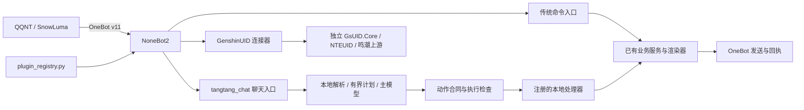

# 开发：Agent 工程导航

供接手本仓库的编码 Agent 使用。先读 [AGENTS.md](../AGENTS.md) 和 [维护 Skill](../skills/qq-bot-maintainer/SKILL.md)，再按任务沿本页定位代码。本文描述当前实现与已知边界，不是运行快照；开关、模型、队列、进程和部署状态必须现场读取。功能细节以 [文档总览](README.md) 对应的唯一功能文档为准。

## 先分清四种“注册与技能”

| 对象 | 权威入口 | 实际作用与边界 |
| --- | --- | --- |
| NoneBot 插件注册表 | [plugin_registry.py](../bot/application/plugin_registry.py) | 决定进程启动时加载的插件、传输和先后顺序；不是热卸载管理器。`after` 是顺序约束，不会自动装卸依赖。 |
| 机器人能力清单 | [skill-registry.json](../config/skill-registry.json)、[skills.py](../bot/services/skills.py) | 登记功能归属、命令、版本、权限和本地动作；有清单条目不表示模型能调用它。 |
| 聊天可执行动作 | [local_skill_contract.py](../bot/services/local_skill_contract.py)、[local_features.py](../bot/application/local_features.py) | 参数白名单与已注册处理器共同决定可执行接口；运行时还检查开关、权限、灰度和依赖。 |
| 编码 Agent 维护 skill | [qq-bot-maintainer](../skills/qq-bot-maintainer/SKILL.md) | 告诉开发者如何理解、修改和验证工程；不会作为 QQ 聊天的工具自动注入。 |

不要用插件数、清单条目数或 `#` 命令数代替聊天可调用动作数。新增一个清单条目也不会自动实现模型调用。

## 运行链路与所有权

- `bot/plugins` 负责事件、命令和启动/关闭钩子；`bot/application` 负责跨功能编排；`bot/services` 负责业务、存储、协议和渲染；`bot/integrations` 负责外部运行时兼容。禁止插件互相导入，服务不得反向导入应用或插件。
- [bot/__main__.py](../bot/__main__.py) 只从插件注册表加载本地插件。游戏上游是独立依赖，不可通过修改上游源码实现本项目功能。
- 服务与处理器应复用原有统计、日程、小游戏、缘分和游戏排行实现。不要让模型现场生成程序或另建平行业务实现。
- 群域、权限、功能开关以 SQLite 为运行权威；`.env.example` 是配置说明，不代表实例当前值。不要输出 `.env` 全文或将真实身份、域名、路径写入文档和测试。

## 按问题定位

| 任务 | 先读的实现 | 对应文档或验证 |
| --- | --- | --- |
| 插件加载、功能增删 | `plugin_registry.py`、`bot/__main__.py`、目标插件 | [功能生命周期](../skills/qq-bot-maintainer/references/feature-lifecycle.md)、`tests/test_plugin_registry.py` |
| 群范围、权限、总控 | `bot/plugins/group_settings.py`、`bot/services/group_domains.py`、`bot/services/passive_settings.py` | [权限与范围](功能-权限与范围.md) |
| 呼叫、合并消息、续聊、主动发言 | `bot/plugins/tangtang_chat.py`、`bot/application/chat_continuation.py`、`bot/application/proactive_chat.py`、`bot/services/chat_dispatch.py` | [糖糖聊天](功能-糖糖聊天.md)、`tests/test_chat_continuation.py` |
| 模型请求、提示词、回复解析 | `bot/services/tangtang_chat.py`、`bot/services/tangtang_reply.py`、`bot/services/tangtang_runtime.py` | `tests/test_tangtang_chat.py`、`tests/test_tangtang_reply.py` |
| 口语调用本地功能 | `bot/services/tangtang_features.py`、`bot/services/agent_plan.py`、`bot/services/local_skill_contract.py`、`bot/application/local_features.py` | [技能注册表](功能-技能注册表.md)、`tests/test_conversational_skills.py` |
| 人格选择、冻结版本、表情、语音 | `bot/application/personas.py`、`bot/services/persona_engine.py`、`bot/services/persona_profiles.py`、`bot/plugins/persona_management.py` | [人格与语音](功能-人格与语音.md) |
| 长期记忆 V2、证据、行动回执 | `bot/services/persona_inbox.py`、`persona_cognition.py`、`persona_actions.py`、`persona_turn.py` | `tests/test_persona_v2_runtime.py`、`scripts/report_persona_memory.py` |
| 自动个人画像 | `bot/application/persona_observer.py`、`bot/services/persona_profile_worker.py`、`persona_profile_store.py` | `tests/test_persona_profiles.py`、`scripts/report_persona_memory.py` |
| 增量群话题摘要 | `bot/services/group_summary.py`、`group_summary_worker.py`、`tangtang_db.py` | [群聊话题摘要](功能-糖糖聊天.md#群聊话题摘要) |
| 上游或图片功能 | 对应插件、现有服务/渲染器、`bot/integrations` | [上游维护](../skills/qq-bot-maintainer/references/nte-upstream.md)、[功能地图](README.md#功能地图) |
| 启停、看门狗、部署核验 | `scripts/start_all.ps1`、`stop.ps1`、`start.ps1`、`verify_full_stack.ps1` | [维护操作](../skills/qq-bot-maintainer/references/operations.md) |

表中缩写文件名沿用同一单元格前面的目录。修改前核对 `git status --short`，保留其他会话的未提交改动；不要把磁盘最新代码自动当作当前进程已加载代码。

## 聊天与技能执行合同

1. 日常聊天保留人格和群聊语境。明确功能请求才进入本地技能分支；主动聊天不能发起这些调用。
2. 常见完整请求由本地解析或有界计划识别；无法完整解析的组合请求交给主模型理解，不执行残缺计划或丢掉半句请求。
3. 主模型获得稳定的普通用户工具全集，以原生 tool calling 提出最多六个有序动作；群开关和依赖可用性只进动态状态。迁移期继续兼容 `feature_calls` / `feature_call`，但同一请求只执行一种协议。模型输出是请求，不是授权或执行结果。
4. 严格校验动作与参数、处理器注册、群/全局开关、角色、技能发布范围及依赖。整批预检后每步仍需复核；停用、切换人格或过期会话不能继续发旧结果。
5. 处理器调用原有实现。合并消息须在调用边界还原为原始 OneBot 事件；不能仅凭对象有 `group_id` 就假定它是 `GroupMessageEvent`。
6. `FeatureDelivery` 将发送绑定原事件并核验平台 `message_id`。只有实际确认的输出才记作送达；部分失败要如实反馈，多步执行不具有事务回滚能力。

工具注册以 `agent_tools.py` 为准，动作参数与旧兼容读取还受 `ACTION_CONTRACTS` 约束。当前 44 个稳定工具包含两个知识检索、30 个只读 QQ 动作和 12 个显式状态动作。只读部分覆盖排行、日程、帮助、状态、本人印象、受限档案、缘分查询、美图及 NTE/鸣潮细分排行；写部分覆盖缘分抽取／强取／离婚和四类小游戏操作。档案和状态目标只能是本人或本轮消息唯一真实 `at`，原文和图片不回灌模型。写工具只走原生调用，每批最多一个，并使用模型请求前状态指纹、插件锁内复核和 `request_id + action + sequence` 幂等占位；主动聊天、历史、摘要和引用不能触发。NTE／鸣潮 Agent 动作还必须通过 `bot/integrations/game_workflow_adapter.py` 的审核枚举构造类型化请求，禁止命令字符串执行。公告发布仍未开放。

新增聊天动作需要一起更新：原功能处理器、动作合同、技能清单 `local_actions`、路由/执行边界测试及功能文档。确认旧直接命令仍复用相同业务结果，禁止模型编造榜单或伪称已经完成。

## 上下文、记忆与画像分别是什么

| 数据 | 来源与用途 | 不能混同为 |
| --- | --- | --- |
| 当前请求与近期互动 | 当前输入、被选入的历史与近期群消息 | 所有历史都已放入一次模型请求 |
| 群聊话题摘要 | 原始群消息库；旧摘要加新增消息，按话题提交新版本后推进游标；当前只向达妮娅注入 | 个人性格画像或可全文检索的聊天档案 |
| 个人长期记忆 V2 | 接收时持久化证据；有来源、修订、范围和遗忘限制；同一用户可跨群延续 | 原始群聊天记录跨群共享，或修改角色核心身份 |
| 自动个人画像 | 独立生成与复核任务；已审版本可用，失败保留上一有效版本和可恢复任务 | 模型随口猜测，或刚收到消息就全部整理完成 |
| 公共成长与话题素材 | 独立来源、审核、开关和后台任务 | 个人记忆队列或群摘要队列 |

字符裁剪设为 `0` 只表示相应层不按字符截断；消息窗口、图像窗口、摘要选取、模型上下文、上游请求限制和超时仍然存在。模型的当前配置通过 `config_loader.load()` 的非敏感字段核对，不能从文档默认值推断。不要为加大文字窗口顺带扩大已约定的图像范围。

图片新增读取按当前消息、引用和用户／群聊各上一条的来源合同执行，主动接话仅取命中消息。`tangtang_media.py` 负责来源与解码，`vision_request.py` 在发送边界检查整个请求的 high 尺寸及大小限制，`tangtang_db.py` 保存随轮次保留的去重图片。用户黑名单不影响发言计数，但过滤对话和引用来源；名单变化使旧前缀失效，不能为缓存命中保留禁用内容。

后台任务分别有开关、队列与失败重试。`report_persona_memory.py` 只读输出聚合状态；“worker 已启动”“有成功版本”和“队列已追平”是三种不同验收结果。

## 达妮娅的加载、停用与卸载边界

达妮娅是共享聊天引擎中的一个 `PersonaProfile`，并不存在独立的 `denia` 插件。生产组合层通过 `locked_persona="denia"` 固定实时聊天；糖糖仍在 [load_personas](../bot/services/persona_profiles.py) 中装配，只用于保留旧数据、资源兼容和测试，不再成为有效聊天人格。当前关联项如下：

| 所有者 | 负责内容 |
| --- | --- |
| `tangtang_chat` 插件 | 呼叫与聊天入口、原始群消息/观察采集、续聊协调、主动计时任务、本地技能调用 |
| `persona_management` 插件 | 人格管理命令；启动公共后台、个人记忆、画像、群摘要和语音监督；进程关闭时取消任务、关闭调度器和语音客户端 |
| `tangtang_model_switch`、`tangtang_proactive` 插件 | 模型/主动策略配置，注册表含 `after=("tangtang_chat",)` |
| `group_settings` 插件 | 总控和群开关，也直接使用共享 `persona_engine` |
| 共享服务与运行数据 | 模型配置、人格引擎、数据库、表情与语音，不能仅按文件名前缀删除 |

| 操作 | 当前支持与限制 |
| --- | --- |
| 切换本群人格 | 已停用；旧切换指令只返回达妮娅固定状态，SQLite 中已有糖糖选择继续保留但不生效。 |
| 关闭/恢复聊天 | 支持群级及机器人级呼叫/主动聊天开关，保留各群原设置和已存资料；这是可恢复停用。 |
| 停止后台模型整理 | 需核对独立开关；`人格后台整理` 管理记忆/画像/公共整理，群摘要另有配置与聊天门。只关呼叫聊天不等于停止主动聊天、画像和语音。 |
| 禁止某个技能调用 | 技能发布控制是调用门，不卸载插件、NoneBot matcher 或后台任务，也不能假定它会关闭全部旧指令。 |
| 删除插件后重启 | 属于代码变更：同步注册表、顺序依赖、技能清单、调用方、测试和文档；保留数据并验证其他功能。没有通用的一键拆除配置。 |
| 进程内无损热卸载 | 尚未实现完整协议；注册表启动加载、进程退出清理不能证明支持单功能运行中卸载。 |

机器人级开关的实际命令和权限见 [权限与范围](功能-权限与范围.md) 与 [人格与语音](功能-人格与语音.md)。聊天停用本身不会删除 SQLite 数据；停用期间未执行的回复也不会自动补发。“无损”不能解释为取消进行中请求后还能保证完成原回复。

需保留的运行数据至少包括主数据库（位置由配置决定）、`data/tangtang/tangtang.db`、`data/personas/state.db`、`data/personas/denia-history.db`、实例声线配置及资源、技能审计数据。清缓存、切人格或卸载代码均不是删除这些数据的授权。

## 已知结构缺口与后续模块化验收

- [group_summary_worker.py](../bot/services/group_summary_worker.py) 当前从服务层引用 `bot.application.personas`，不符合仓库层级约束。当前 [架构校验器](../scripts/validate_architecture.py) 拦截插件互导、下层导入插件、环和重复实现，但尚未拦截全部 `services -> application` 引用。不能把此例当成允许的模式，也不能把校验通过表述为完整层级证明。
- 如用户要求真正可插拔，需单独实现并验收：依赖图与启用配置、统一 `start/stop` 所有权、停止接单与处理中任务收尾、matcher/预处理器/处理器注销、后台取消并等待退出、客户端关闭、数据保留与重载恢复。
- 验收必须覆盖重复启停、任务/处理器不重复、旧会话停止发送、持久化数据可恢复、关闭聊天后其他直接功能仍可用。先界定“可恢复停用”“重启后不加载”还是“运行中热卸载”，不能用前两项测试替代第三项。

此处记录当前缺口与验收标准，不表示热卸载已经交付。

## 验证与故障定位

- 维护门禁以 [operations.md](../skills/qq-bot-maintainer/references/operations.md) 为准；提交前运行全部必需校验和 pytest。仅改文档时先验证文档链接、公开发布边界和 skill；不要宣称这等同于运行时回归。
- 技能改动补跑 `scripts/validate_skill_registry.py`、`scripts/validate_skill_security.py`、`scripts/validate_design_compliance.py`，结合 `tests/test_conversational_skills.py` 和相应原功能测试。模型评估、QQ 实发与纯本地测试须分别报告。
- 真实故障按消息时间/请求关联检查：传输接收、NoneBot 路由、模型调用、技能执行、发送回执、后台状态。不要仅凭模型说“不会”就断定本地没有功能。
- 诊断入口包括 `logs/bot.out.log`、`logs/bot.err.log`、`logs/bot.lifecycle.log`、聊天用量/调用记录、技能审计与 `scripts/report_persona_memory.py`。分享结果时不输出群聊原文、身份或密钥。
- Python 代码需生效时只重启 NoneBot，并验证 PID、监听、OneBot 连接和日志。纯文档/维护 skill 更新不需要重启机器人。

当动作合同、后台所有权或装卸能力改变时，同步本页、维护 skill 的相应指引及原功能文档；不要另存一份容易过期的功能清单或带私有运行数据的交接快照。
